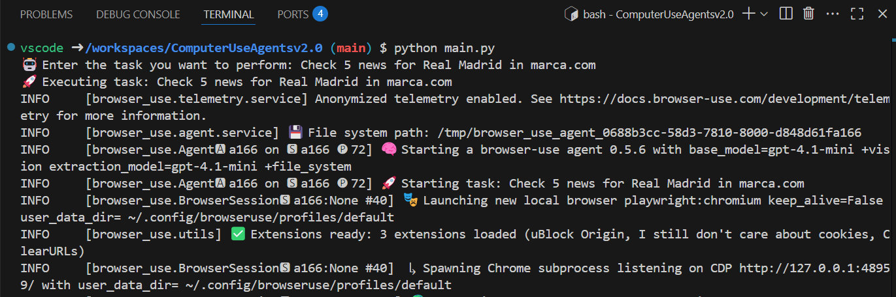

# Computer Use Agents v2.0

An AI-powered web automation interface that allows you to control browser interactions through natural language tasks.


## Features

- 🤖 **AI-Powered Browser Automation**: Uses advanced AI models to understand and execute web tasks
- 🌐 **Beautiful Web Interface**: Clean, modern UI for task submission
- 🖥️ **Real-time Browser Console**: Visual feedback through integrated browser console
- ⚡ **FastAPI Backend**: High-performance async web framework
- 🔄 **Live Status Updates**: Real-time task monitoring
- 🐳 **DevContainer Ready**: Pre-configured development environment
- 💻 **Dual Interface**: Web UI and CLI options


## Two Ways to Use

### 1. Web Interface (Recommended) 🌐

The web interface provides a beautiful, user-friendly way to interact with the AI agent:

- **File**: `app_browser.py`
- **Access**: `http://localhost:5000`
- **Features**: 
  - Modern, responsive UI
  - Real-time status updates
  - Automatic browser console opening
  - Task examples and suggestions
  - Visual feedback

### 2. Command Line Interface ⚡

For quick tasks and automation scripts:

- **File**: `app_cli.py`
- **Usage**: Direct task execution
- **Features**:
  - Faster startup
  - Script-friendly
  - Command-line arguments support
  - Perfect for automation



## Installation Options

### Option 1: DevContainer (Recommended) 🐳

This project includes a **complete DevContainer setup** with everything pre-configured:

- Python 3.12 environment
- All dependencies pre-installed
- Browser automation tools (Playwright, Chromium)
- Desktop environment with VNC access
- Azure CLI integration

**Requirements:**
- [Visual Studio Code](https://code.visualstudio.com/)
- [Docker Desktop](https://www.docker.com/products/docker-desktop/)
- [Dev Containers Extension](https://marketplace.visualstudio.com/items?itemName=ms-vscode-remote.remote-containers)

**Setup:**
1. Clone this repository
2. Open in VS Code
3. Click "Reopen in Container" when prompted
4. Wait for the container to build (first time only)
5. You're ready to go! 🚀

### Option 2: Local Installation 💻

If you prefer to run locally without Docker:

**Requirements:**
- Python 3.8 or higher
- pip package manager
- Node.js (for Playwright browser automation)
- Git

**Installation steps:**

1. **Install Python dependencies:**
   ```bash
   pip install -r requirements.txt
   ```

2. **Install Playwright browsers:**
   ```bash
   playwright install-deps
   playwright install chromium
   ```

3. **Set up environment:**
   ```bash
   cp .env.example .env
   # Edit .env with your Azure OpenAI credentials
   ```

## Quick Start

### Using the Quick Start Script (Easiest)

```bash
./run.sh
```

This script will:
- Check for the `.env` file and create it if needed
- Show you all available options
- Start the application based on your choice

### Using Web Interface

1. **Start the web application:**
   ```bash
   python3 app_browser.py
   ```

2. **Open your browser** and navigate to `http://localhost:5000`

3. **Enter a task** and watch the AI navigate for you!


### Using Command Line

1. **Run with interactive prompt:**
   ```bash
   python3 app_cli.py
   ```

2. **Or pass task as argument:**
   ```bash
   python3 app_cli.py "Search for Python jobs on LinkedIn"
   ```

## Configuration

Create a `.env` file with your Azure OpenAI credentials:

```env
AZURE_OPENAI_DEPLOYMENT=your-deployment-name
AZURE_OPENAI_KEY=your-api-key
```

**How to get Azure OpenAI credentials:**

1. Go to [Azure Portal](https://portal.azure.com/)
2. Create an Azure OpenAI resource
3. Deploy a model (e.g., GPT-4o)
4. Get your API key and deployment name from the resource

## Example Tasks

Here are some tasks you can try with the AI agent:

### Research & Comparison
- "Compare the pricing of GPT-4o and DeepSeek-V3 on their official websites"
- "Find and compare the features of the top 3 project management tools"
- "Research the latest trends in artificial intelligence"

### News & Information
- "Search for the latest AI news on TechCrunch"
- "Find recent articles about sustainable energy on BBC News"
- "Get the latest cryptocurrency market updates"

### Weather & Location
- "Find the current weather in New York and London"
- "Check the weather forecast for this weekend in Paris"
- "Find tourist attractions in Tokyo"

### Job Search
- "Search for Python developer job openings on LinkedIn"
- "Find remote software engineering positions"
- "Look for data science internships in California"

### Shopping & Products
- "Compare laptop prices on different e-commerce sites"
- "Find the best-rated smartphones under $500"
- "Search for eco-friendly cleaning products"


## Architecture

### System Overview

```
┌─────────────────┐    ┌─────────────────┐    ┌─────────────────┐
│   Web Browser   │    │   FastAPI App   │    │  Azure OpenAI   │
│  (localhost:5000)│◄──►│ (app_browser.py)│◄──►│    Service      │
└─────────────────┘    └─────────────────┘    └─────────────────┘
                                │
                                ▼
                       ┌─────────────────┐    ┌─────────────────┐
                       │  Browser-Use    │◄──►│ Browser Console │
                       │    Library      │    │ (localhost:6080)│
                       └─────────────────┘    └─────────────────┘
```

### Components

- **Frontend**: Modern HTML/CSS/JavaScript interface with responsive design
- **Backend**: FastAPI with async support for high performance
- **AI Engine**: Azure OpenAI integration via browser-use library
- **Browser Control**: Automated browser interactions with Playwright
- **Visual Feedback**: Real-time browser console with VNC access

## Development

### DevContainer Development

The project is optimized for DevContainer development:

- **Auto-reload**: Changes are automatically detected and applied
- **Pre-configured**: Everything set up and ready to use
- **Isolated**: Clean environment without affecting your host system
- **Portable**: Same environment for all developers

### Local Development

If developing locally:

```bash
# Start with auto-reload
python3 app_browser.py

# The server will restart automatically when you make changes
```

### Browser Console

The browser console is available at `http://localhost:6080` and provides:

- **Real-time visual feedback** of AI actions
- **Desktop environment** accessible via web browser
- **VNC connection** for advanced debugging
- **Automatic opening** when tasks are submitted


## Troubleshooting

### Common Issues

**1. ModuleNotFoundError: No module named 'fastapi'**
```bash
# Solution: Install dependencies
pip install -r requirements.txt
```

**2. Azure OpenAI Authentication Error**
```bash
# Solution: Check your .env file
cp .env.example .env
# Edit .env with correct credentials
```

**3. Browser Console Not Opening**
- Check if port 6080 is available
- Ensure Docker Desktop is running (for DevContainer)
- Try manually opening `http://localhost:6080`

**4. Port 5000 Already in Use**
```bash
# Solution: Kill existing processes
pkill -f "python3 app_browser.py"
# Or use a different port in app_browser.py
```

### DevContainer Issues

**Container won't start:**
- Ensure Docker Desktop is running
- Check available disk space
- Try rebuilding: `Ctrl+Shift+P` → "Dev Containers: Rebuild Container"

**Performance issues:**
- Allocate more resources to Docker Desktop
- Close unnecessary applications
- Use local installation if DevContainer is too slow

## Requirements

### For DevContainer (Recommended)
- [Visual Studio Code](https://code.visualstudio.com/)
- [Docker Desktop](https://www.docker.com/products/docker-desktop/) (4GB RAM minimum)
- [Dev Containers Extension](https://marketplace.visualstudio.com/items?itemName=ms-vscode-remote.remote-containers)

### For Local Installation
- Python 3.8+ (3.12 recommended)
- Node.js 16+ (for Playwright)
- Git
- 4GB RAM minimum
- Azure OpenAI account and API key

## Contributing

Contributions are welcome! Please feel free to submit a Pull Request.

### Development Setup
1. Fork the repository
2. Use the DevContainer for consistent environment
3. Make your changes
4. Test both web and CLI interfaces
5. Submit a pull request

## License

This project is open source and available under the MIT License.

## Support

- 📖 **Documentation**: Check this README for detailed instructions
- 🐛 **Issues**: Report bugs or request features via GitHub Issues
- 💬 **Discussions**: Share ideas and ask questions in GitHub Discussions

---

**Kiko de Angel Made with ❤️ for the AI automation community**
